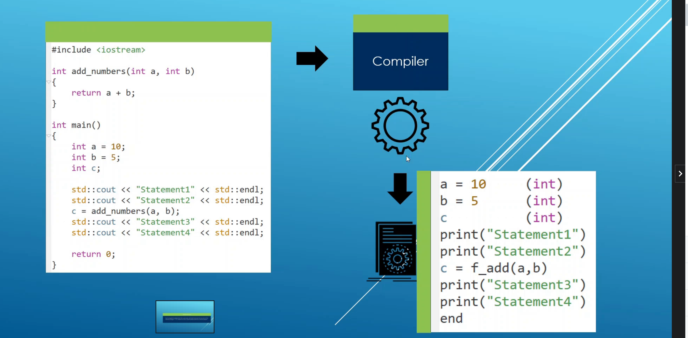

PROGRAM MEMORY MAP

Program is compiled via compiler into an executable/binary which can be executed to run the program

Program when run is loaded into computer memoroy, into RAM which actively runs things in your computer, diff than hard drive

Stored into special section of memory called Program Area, not quite loaded into real memory per say since
if lots of programming are running we could exhaust all memory

Virtual memory -> fools your program intothinking it is the only program running on OS and all memroy resoruces belong to it (not true ofc in reality), memory map is the view your program has of RAM,
each program is abstracted into a process and each process has access to the memory range of 0 - (2^n - 1) where N is
64 since my system is a 64 bit system

When we run the program, the progrma will go through a part of the cpu called Memory Management Unit(MMU)
which transforms things between the memory map and RAM. The entire program is not loaded into real memory, only parts that are about to be executed rest goes into virtual memory

